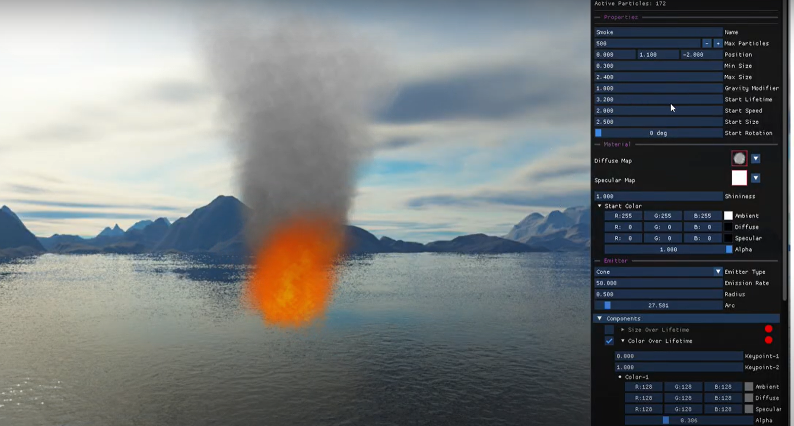
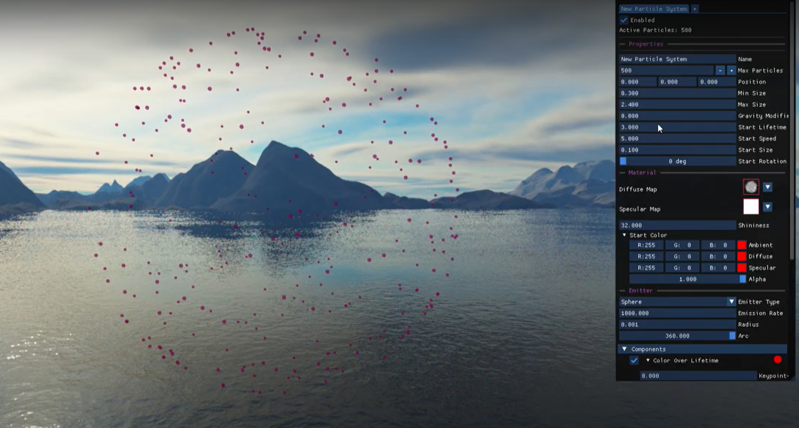
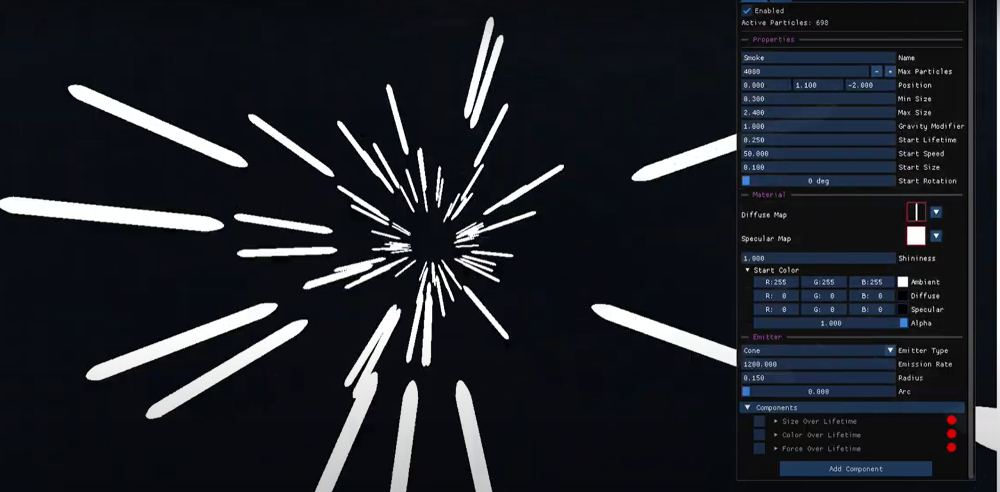
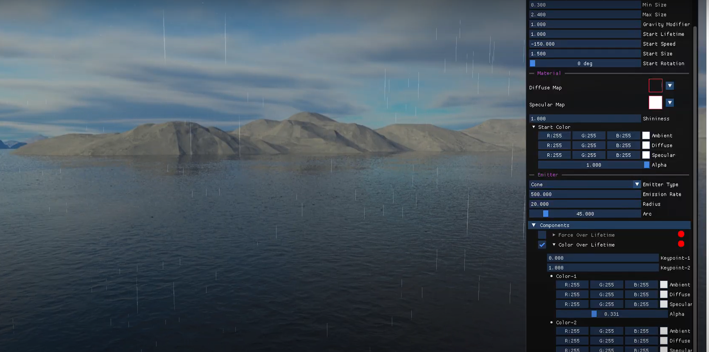
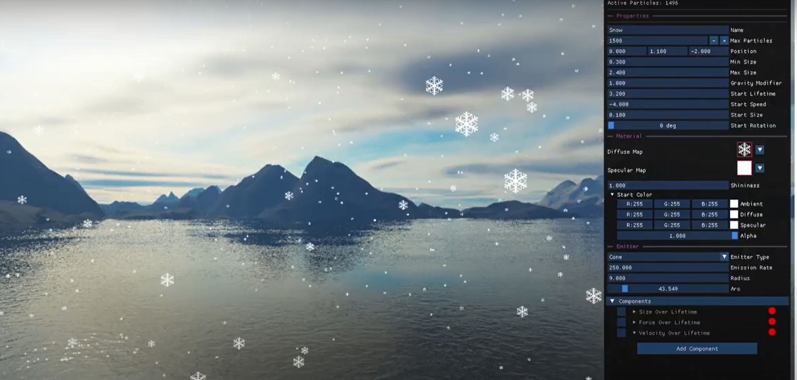

# Particle System Simulator
A standalone 3D particle system simulator made with OpenGL and C++.

## Table of Contents
1. [Introduction](#introduction)
2. [Features](#features)
3. [Demos](#demos)
4. [Installation](#installation)
5. [Technologies Used](#technologies-used)
6. [Contributing](#contributing)
7. [Contact](#contact)

## Introduction
Welcome to the 3D Particle System Simulator! This project aims to provide a realistic, interactive, and user-friendly platform for generating and manipulating 3D particle effects. Designed to fill the gap in the market for robust 3D particle simulators, our simulator supports various particle effects such as snow, fire, fireworks, and hyperspeed, making it an excellent tool for both novice and professional users in the computer graphics industry.

## Features
- **Realistic 3D Particle Effects**: Create diverse particle effects bounded only by your imagination!
- **Save and Load System**: Easily save and load your particle system configurations.
- **Skybox Control**: Enable or disable the skybox to suit your visual needs.
- **Particle System Editor**: An intuitive editor for creating and customizing particle systems.
- **Real-Time Interaction**: Modify particle system parameters in real-time.
- **Dynamic User Interface**: A user-friendly interface to control particle properties, textures, colors, and emitter settings.
- **BÉZIER Curve Force Control**: Utilize BÉZIER curves to fine-tune forces over the particle's lifetime.

## Demos











## Installation
1. Clone the repository:
    ```bash
    git clone git@github.com:mehmetfatiherdem/Particle-System-Simulator.git
    ```
2. Build the project using Visual Studio (it might not work with other compilers).

## Technologies Used
- **C++**: Core programming language.
- **OpenGL**: Graphics rendering API.
- **GLFW**: Window and input handling library.
- **GLEW**: OpenGL extension wrangler library.
- **GLM**: OpenGL Mathematics library.
- **ImGui**: Immediate mode graphical user interface.
- **ImPlot**: A better plotting tool for ImGui.
- **RapidJSON**: A JSON parser/generator.
- **stb**: Image loader library.

## Dependencies
- [GLFW](https://www.glfw.org/)
- [GLEW](http://glew.sourceforge.net/)
- [GLM](https://glm.g-truc.net/0.9.9/index.html)
- [Imgui](https://github.com/ocornut/imgui)
- [ImPlot](https://github.com/epezent/implot)
- [RapidJSON](https://rapidjson.org/)
- [stb](https://github.com/nothings/stb)

## Contact
For any inquiries or feedback, please contact us at [talhasezer4@gmail.com](mailto:talhasezer4@gmail.com) [mehmeterdem1024@gmail.com](mailto:mehmeterdem1024@gmail.com) [m.tunahanbas90@gmail.com](mailto:m.tunahanbas90@gmail.com).